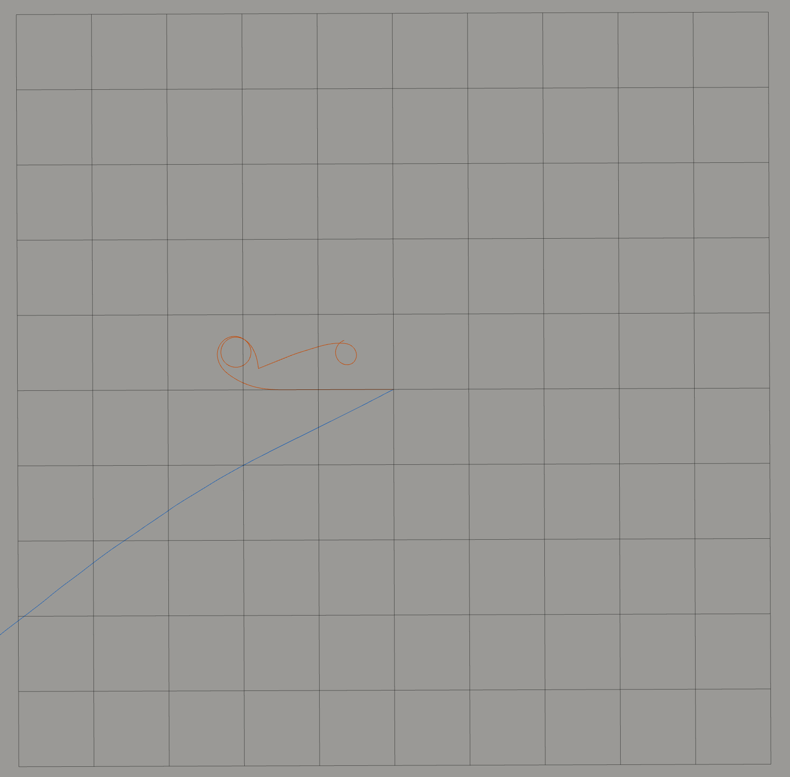

## Assignment Implementation: EE5531 Project 3
**Author:** Anders Smitterberg

# Project 3: State Estimation and Odometry
This repository contains a ROS 2 node that implements two distinct methods for robot state estimation: **Dead Reckoning** (based on commanded velocity) and **IMU Integration** (double integration of acceleration). The node processes replayed data from a provided rosbag to calculate, compare, and visualize the robot's estimated trajectories in real-time.

### Prerequisites
* Ubuntu 24.04
* ROS 2 Jazzy
* `proj3.bag` file located in the workspace directory

### Initial Setup and Testing
1. **Create and enter a new ROS 2 workspace:**
    ```bash
    mkdir -p ~/proj3_ws/src
    cd ~/proj3_ws/src
    ```
2. **Download the rosbag:**
    * Download the `proj3.bag` folder from [this repository](https://github.com/Robust-Autonomous-Systems-Laboratory/ee5531_proj3/tree/main) into your workspace root (`~/proj3_ws`) and rename it to `proj3.bag`.
3. **Clone the repository:**
    ```bash
    git clone <repository-url> .
    ```
4. **Build the workspace:**
    ```bash
    cd ~/proj3_ws
    colcon build
    ```
5. **Source the environment:**
    ```bash
    source install/setup.bash
    ```
6. **Run the estimator node:**
    ```bash
    ros2 run dead_reckoning estimator
    ```
7. **Play the rosbag:**
    * In a separate terminal, play the data with clock emulation to sync the node timestamps:
        ```bash
        ros2 bag play proj3.bag --clock
        ```
8. **Visualization:**
    * Open RViz2 using the provided configuration file to see the pre-configured Path trajectories:
        ```bash
        ros2 run rviz2 rviz2 -d src/proj3_conf.rviz --ros-args -p use_sim_time:=true
        ```
---

### Results and Analysis

#### Example Output


Above is depicted the expected output of the system depicting the two divergent estimates, dead-reckoning (red) and IMU integration (blu). Blu appears to trace an almost linear path off the map, while red takes a plausible path.

#### Trajectory Comparison
* **How do the two trajectory estimates compare?** The estimates diverge almost immediately. The Dead Reckoning path traces a coherent, plausible shape, whereas the IMU integration estimate drifts significantly, appearing to wander pretty much unboundedly with only minor orientation changes.
* **Do they agree initially?** Yes, both estimates agree initially as they are initialized to the same starting pose: $(x, y, \theta) = (0, 0, 0)$.
* **When do they diverge?** Divergence occurs immediately upon the start of motion, affecting both heading and velocity.

#### Drift Analysis
* **Which method exhibits more drift?** The IMU integration method exhibits substantially more drift. While no ground truth is available for absolute verification, the Dead Reckoning estimate provides a far more plausible looking approximate of robot motion compared to the path generated by the IMU.
* **Why?** 
    * **Dead Reckoning:** This method relies on first-order Euler integration of velocity commands. It assumes the motors respond instantly and perfectly to control signals, ignoring system dynamics (acceleration, inertia) and physical realities like wheel slip.
    * **IMU Integration:** Performance is significantly degraded due to the "double integration" problem. We are integrating acceleration twice to obtain position, which causes any sensor noise, systemic error, or discretization error to compound over time. Additionally, if the IMU is not perfectly aligned with the robot's frame, or if the Z-axis is not perfectly vertical, gravity components will bleed into the X and Y acceleration data, causing additional drift.

#### Sources of Error
* **Dead Reckoning:**
    * **Model Fidelity:** Ignores higher order robot dynamics and assumes instantaneous velocity changes. Assumes we can perfectly describe the robot using the given model.
    * **Physical:** Ignores wheel slip and other physical phenomenon.
    * **Computational:** Finite sampling rate and precision limits of Euler integration.
* **IMU Integration:**
    * **Sensor Noise & Systematic Error:** Inherent sensor noise is amplified through double integration.
    * **Alignment:** Misalignment between the IMU frame and the robot frame.
    * **Gravity Contamination:** Even a minor tilt could cause the gravity vector to project onto the linear acceleration axes.
    * **Numerical Drift:** Compounding errors from discrete integration steps.

#### Improving Accuracy
* **Sensor Fusion:** Implementing a Kalman Filter, as Chas discussed, to fuse the two estimates would likely yield a result superior to either individual method.
* **Calibration:** Assuming the robot is initially completely still and using the initial stationary period to estimate and subtract systematic error from the IMU such as gravity could reduce drift.
* **Integration Methods:** employing higher-order integration techniques, like AB2 or others, instead of simple Euler integration could reduce error.

#### Motion Assumptions
* **Dead Reckoning:** Assumes the robot executes velocity commands instantly and perfectly without wheel slip.
* **IMU Integration:** Assumes the sensor is perfectly level, calibrated, and aligned with the robot's coordinate frame, reporting accurate linear and rotational acceleration without systematic error.

---

### AI Disclosure
Google Gemini was used to assist with the formatting and structure of this README and provided debugging assistance for the ROS 2 Python node implementation. Help specifically needed subscribing to and publishing two topics in a single node, implementing the QoS requirements, and general ROS best practices, including how to determine which dependancies to include in the packages.xml and how to find those.